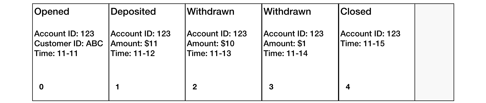
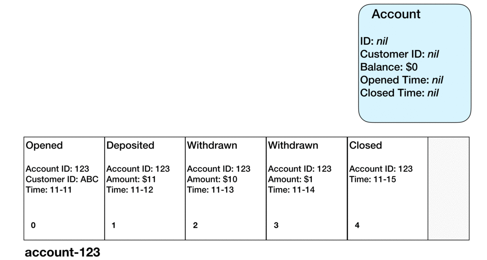

# Event Sourcing

Event sourcing is a messaging pattern that takes advantage of the evented nature of a [pub/sub](./pub-sub.md) architecture to simplify application data storage.

## Pub/Sub

A system based on pub/sub provides ample opportunity to simplify application data storage by using [event sourcing](./event-sourcing.md). Because there's pub/sub, there is events. And once a system is based on events, event sourcing can be leveraged.

## Event Streams and Entities

Every event stream records the lifecycle events of a single [entity](./services/entities.md).

Each activity of an entity's life is recorded as an event, and written to the entity's stream.

## Projection

An entity's state is _projected_ from its event stream. Each event is read in sequence, and attributes from the event are either copied directly to the entity, or used to otherwise calculate an update to the entity's state.

